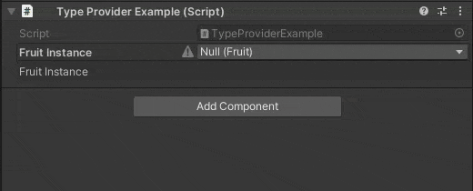

# Vertx.Decorators
Attributes and Property Decorators for Unity that have access to the SerializedProperty used to draw the field.  
Thanks to [Marcel Wiessler](https://twitter.com/marcel_wiessler) and [this article from Sebastian Schöner](https://blog.s-schoener.com/2019-06-23-best-worst-code/) for the inspiration behind this implementation.  

⚠️ This package requires 2020.3+ ⚠️

## Attributes

- **[TypeProvider]**
- **[TypeProvider(typeof(Example))]**  
Decorates a `[SerializeReference]` field, providing instances of a type that can easily be added via a dropdown.  
  

  
## Details
It's important to note that Decorators still do not draw on collection elements. If you have another use case similar to TypeProvider that requires collection elements, please let me know.  
Otherwise, inheriting from `DecoratorDrawerWithProperty` will provide a normal decorator that has access to the SerializedProperty.  

## Installation

<details>
<summary>Add from OpenUPM <em>| via scoped registry, recommended</em></summary>

This package is available on OpenUPM: https://openupm.com/packages/com.vertx.decorators

To add it the package to your project:

- open `Edit/Project Settings/Package Manager`
- add a new Scoped Registry:
  ```
  Name: OpenUPM
  URL:  https://package.openupm.com/
  Scope(s): com.vertx
            com.needle
  ```
- click <kbd>Save</kbd>
- open Package Manager
- click <kbd>+</kbd>
- select <kbd>Add from Git URL</kbd>
- paste `com.vertx.decorators`
- click <kbd>Add</kbd>  
</details>

<details>
<summary>Add from GitHub | <em>not recommended, no updates through UPM</em></summary>

You can also add it directly from GitHub on Unity 2019.4+. Note that you won't be able to receive updates through Package Manager this way, you'll have to update manually.

- open Package Manager
- click <kbd>+</kbd>
- select <kbd>Add from Git URL</kbd>
- paste `https://github.com/vertxxyz/Vertx.Decorators.git`
- click <kbd>Add</kbd>  
  **or**
- Edit your `manifest.json` file to contain `"com.vertx.decorators": "https://github.com/vertxxyz/Vertx.Decorators.git"`,

⚠️ decorators has a dependency on [Editor Patching](https://github.com/needle-tools/editorpatching) and [Vertx.Utilities](https://github.com/vertxxyz/Vertx.Utilities) so ensure they are referenced into your project to use this package successfully. ⚠️

To update the package with new changes, remove the lock from the `packages-lock.json` file.
</details>